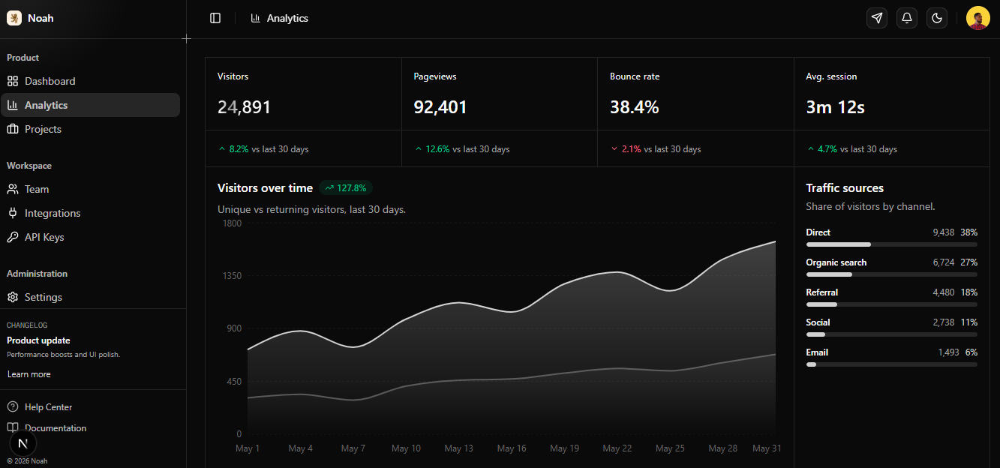

# Dashboard



A custom analytics + project-management dashboard built by **[Noah Ojile](https://noahojile.com)**. Dark-first, animated, and laid out for the kind of metrics work I actually do day-to-day — revenue, traffic, project status, and team activity all in one view.

## Highlights

- **Three pages, real navigation.** Dashboard (`/`), Analytics (`/analytics`), and Projects (`/projects`). The sidebar derives active state from the current route, the header breadcrumb stays in sync, and every link is a `next/link`.
- **Animated page transitions.** Uses the browser's View Transitions API for a cross-fade on every route change, plus a staggered `fade-rise` entry animation for grids of cards.
- **Dark / light mode with a smooth switch.** A sun/moon toggle in the header drives `next-themes`, and the theme swap itself is wrapped in `document.startViewTransition()` so the whole UI cross-fades instead of flashing.
- **Charts that look the part.** A gradient-filled area chart for visitors over time, a bar chart for net revenue, a donut for device breakdown, and animated progress bars for traffic sources.
- **Project board.** A grid of project cards with status badges (on-track / at-risk / blocked / completed), animated progress bars colored by status, tag chips, stacked team avatars, and due dates.
- **Subtle polish.** Hover lift on cards, a shimmering gradient on the headline KPI, and a `prefers-reduced-motion` guard that disables all of the above for users who opt out.

## Stack

- **Next.js 16** (App Router, Turbopack) + **React 19**
- **TypeScript**
- **Tailwind CSS v4** with shadcn/ui (`base-nova` style) and the [`@efferd/dashboard-2`](https://efferd.com) block as the starting point
- **Recharts** for charts
- **next-themes** for dark mode
- **Base UI** primitives via shadcn

## Getting started

```bash
npm install
npm run dev
```

Then open [http://localhost:3000](http://localhost:3000).

## Project layout

```
src/
  app/
    page.tsx              # Dashboard
    analytics/page.tsx    # Analytics
    projects/page.tsx     # Projects
    layout.tsx            # ThemeProvider + TooltipProvider
    globals.css           # tokens + view-transition + animation utilities
  components/
    app-shell.tsx         # sidebar + header + content wrapper
    app-sidebar.tsx       # route-aware sidebar nav
    app-header.tsx        # breadcrumb + theme toggle + portfolio link
    theme-toggle.tsx      # sun/moon, view-transition swap
    analytics/            # KPI cards, visitors chart, sources, devices, top pages
    projects/             # project board + project card
    ui/                   # shadcn primitives
```

## License

Personal project — feel free to read the code; please don't redistribute the project as your own.
